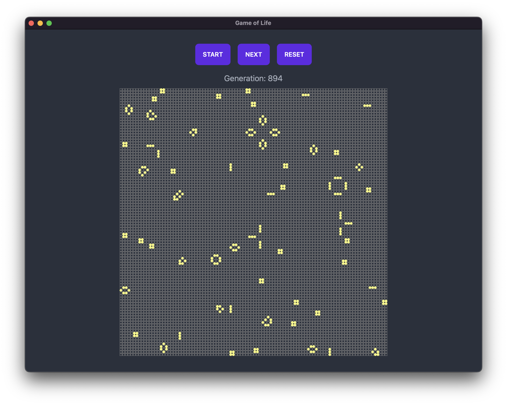

# Game of Life

Simple implementation of Conway's "Game of Life" using [wails.io](https://wails.io/)

The user interface is quite simple

There're 3 buttons and a canvas the prints the nth generation of the cells.

* Start/Stop Button: starts/stops the simulation (the text changes according to the status)
* Next Button: move the simulation forward of one generation (available only with simulation stopped)
* Reset: Reset the simulation to a random initial state (available only with simulation stopped)

## Development

If you want to build the code your self you have to 

* Install Go (1.18+)
* Install Wails
* Run `wails dev` and have fun
